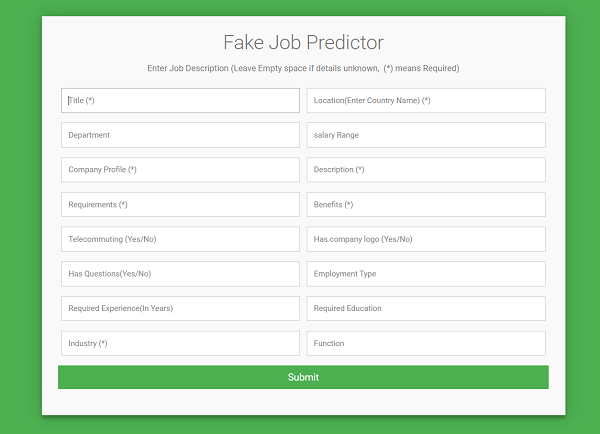

## Problem
Scammers advertise jobs the same way legitimate employers do — online (in ads, on job sites, and social media), in newspapers, and sometimes on TV and radio. They promise you a job, but what they want is your money and your personal information.

## Model Description 
Fake-Job-Predictor is a python based machine learning model, which uses algorithms like the Naive Bayes algorithm and Decision tree classifier algorithm, to predict whether a posted job is fake or real. The model is deployed over heroku and can be viewed [here.](https://fake-job-prediction.herokuapp.com/)

Code for all the detailed analysis and model building can be viewed [here](Fake_job_predictor.ipynb).

  

### Technology Stacks and Libraries

* Numpy
* Pandas
* matplotlib
* Imbalanced-learn
* wordcloud
* Natural Language Toolkit
* Multinomial Naive Bayes (scikit-learn)
* Decision tree classifier (scikit-learn)
* flask

## Analysis of Dataset
The Model uses Employment Scam Aegean Dataset (EMSCAD) , which can be viewed [here.](https://www.kaggle.com/amruthjithrajvr/recruitment-scam)

### Visualizing dataset based on location 

  

### Visualizing dataset based on Experience

  

### Visualizing common words used in the dataset using Wordcloud

  

## Model Evaluation 

### Naive Bayes Approach 
In the first approach, Multinomial Naive Bayes,which is one of the most popular supervised learning classifications was used for the analysis of the categorical text data.  
Classification Accuracy: 0.8980769230769231  
Confusion Matrix:

  

### Decision tree Classifier
In the Second approach, Decision tree classifier was used which classifies inputs by segmenting the input space into regions.  
Classification Accuracy: 0.8173076923076923  
Confusion Matrix:

  

